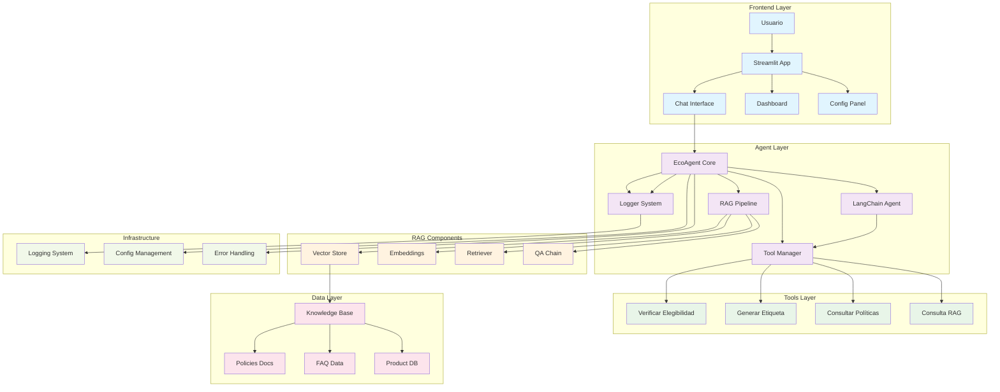
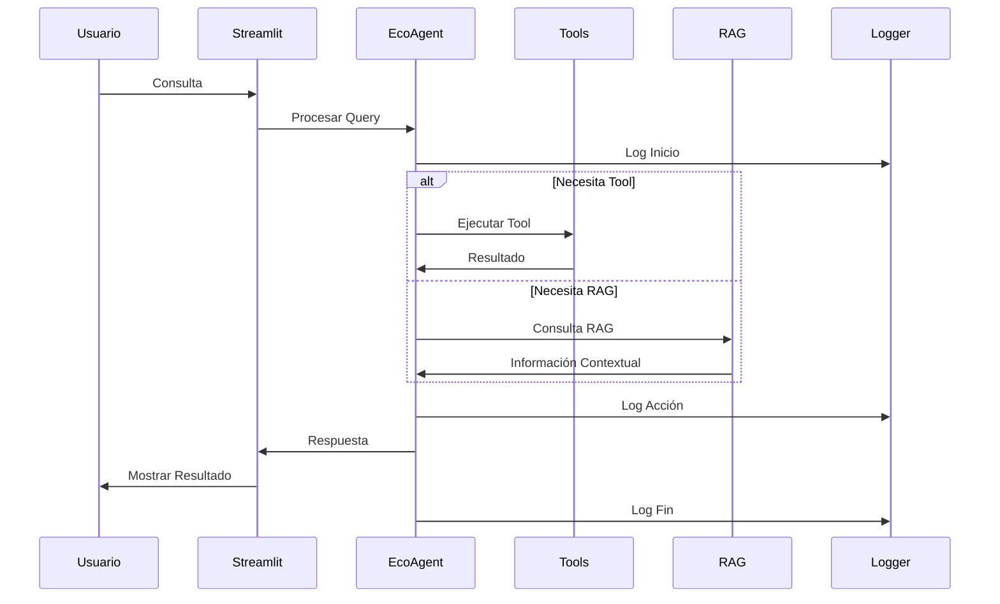
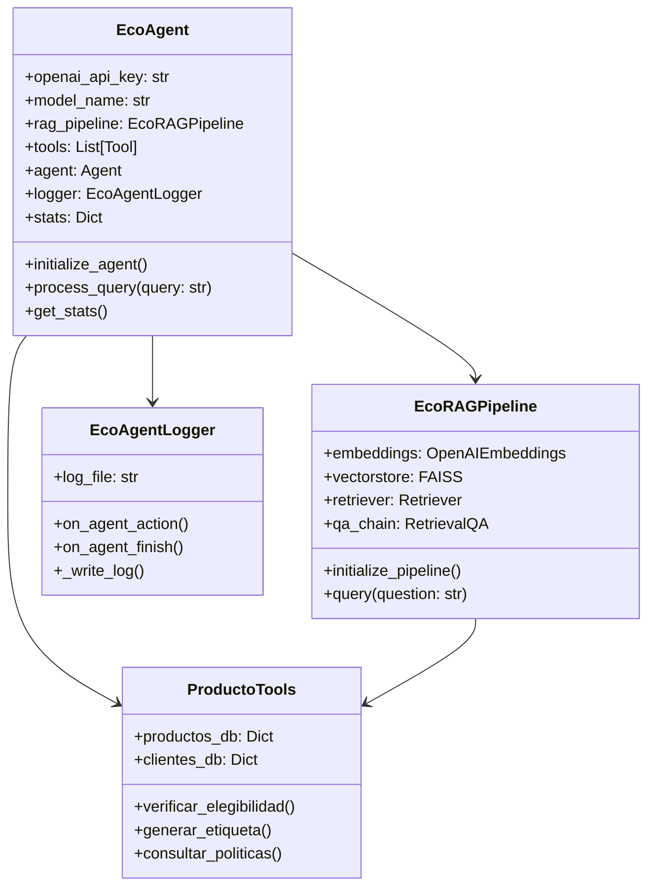

# Diagrama de Arquitectura EcoAgent

```mermaid
graph TB
    subgraph "Frontend Layer"
        A[Usuario] --> B[Streamlit App]
        B --> C[Chat Interface]
        B --> D[Dashboard]
        B --> E[Config Panel]
    end
    
    subgraph "Agent Layer"
        F[EcoAgent Core]
        F --> G[LangChain Agent]
        F --> H[Tool Manager]
        F --> I[RAG Pipeline]
        F --> J[Logger System]
    end
    
    subgraph "Tools Layer"
        K[Verificar Elegibilidad]
        L[Generar Etiqueta]
        M[Consultar Políticas]
        N[Consulta RAG]
    end
    
    subgraph "RAG Components"
        O[Vector Store]
        P[Embeddings]
        Q[Retriever]
        R[QA Chain]
    end
    
    subgraph "Data Layer"
        S[Knowledge Base]
        T[Policies Docs]
        U[FAQ Data]
        V[Product DB]
    end
    
    subgraph "Infrastructure"
        W[Logging System]
        X[Config Management]
        Y[Error Handling]
    end
    
    %% Connections
    C --> F
    G --> H
    H --> K
    H --> L
    H --> M
    H --> N
    
    I --> O
    I --> P
    I --> Q
    I --> R
    
    O --> S
    S --> T
    S --> U
    S --> V
    
    F --> J
    J --> W
    F --> X
    F --> Y
    
    %% Styling
    classDef frontend fill:#e1f5fe
    classDef agent fill:#f3e5f5
    classDef tools fill:#e8f5e8
    classDef rag fill:#fff3e0
    classDef data fill:#fce4ec
    classDef infra fill:#f1f8e9
    
    class A,B,C,D,E frontend
    class F,G,H,I,J agent
    class K,L,M,N tools
    class O,P,Q,R rag
    class S,T,U,V data
    class W,X,Y infra
```

## Flujo de Datos

```mermaid
sequenceDiagram
    participant U as Usuario
    participant S as Streamlit
    participant A as EcoAgent
    participant T as Tools
    participant R as RAG
    participant L as Logger
    
    U->>S: Consulta
    S->>A: Procesar Query
    A->>L: Log Inicio
    
    alt Necesita Tool
        A->>T: Ejecutar Tool
        T->>A: Resultado
    else Necesita RAG
        A->>R: Consulta RAG
        R->>A: Información Contextual
    end
    
    A->>L: Log Acción
    A->>S: Respuesta
    S->>U: Mostrar Resultado
    A->>L: Log Fin
```

## Arquitectura de Componentes

```mermaid
classDiagram
    class EcoAgent {
        +openai_api_key: str
        +model_name: str
        +rag_pipeline: EcoRAGPipeline
        +tools: List[Tool]
        +agent: Agent
        +logger: EcoAgentLogger
        +stats: Dict
        +initialize_agent()
        +process_query(query: str)
        +get_stats()
    }
    
    class EcoRAGPipeline {
        +embeddings: OpenAIEmbeddings
        +vectorstore: FAISS
        +retriever: Retriever
        +qa_chain: RetrievalQA
        +initialize_pipeline()
        +query(question: str)
    }
    
    class ProductoTools {
        +productos_db: Dict
        +clientes_db: Dict
        +verificar_elegibilidad()
        +generar_etiqueta()
        +consultar_politicas()
    }
    
    class EcoAgentLogger {
        +log_file: str
        +on_agent_action()
        +on_agent_finish()
        +_write_log()
    }
    
    EcoAgent --> EcoRAGPipeline
    EcoAgent --> ProductoTools
    EcoAgent --> EcoAgentLogger
    EcoRAGPipeline --> ProductoTools
```
