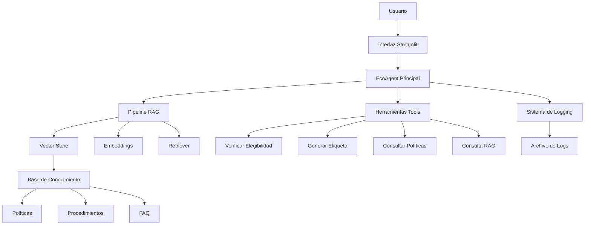

# 🤖 EcoAgent - Agente Inteligente para Devoluciones

[](https://python.org)
[](https://langchain.com)
[](https://streamlit.io)
[](LICENSE)

## 📋 Descripción

EcoAgent es un agente inteligente construido con LangChain que automatiza y optimiza los procesos de devolución de productos. Utiliza técnicas de Retrieval-Augmented Generation (RAG) y herramientas especializadas para proporcionar asistencia completa en la gestión de devoluciones.

### 🎯 Características Principales

- **🤖 Agente Inteligente**: Utiliza LangChain con modelo GPT-4o para procesamiento de lenguaje natural
- **🔧 Herramientas Especializadas**: Automatiza verificación de elegibilidad y generación de etiquetas
- **📚 Pipeline RAG**: Acceso a información contextual sobre políticas y procedimientos
- **🖥️ Interfaz Streamlit**: Interfaz web intuitiva y amigable
- **📊 Sistema de Logging**: Monitoreo completo de interacciones y métricas
- **🔄 Modo Simulado**: Funciona sin API key de OpenAI para desarrollo y pruebas

## 🏗️ Arquitectura del Sistema



## 📁 Estructura del Proyecto

```
EcoAgent/
│
├── agente/                    # Módulo principal del agente
│   ├── __init__.py           # Exportaciones del módulo
│   ├── tools.py              # Herramientas especializadas
│   ├── rag_pipeline.py       # Pipeline RAG
│   └── eco_agent.py          # Agente principal
│
├── app/                      # Aplicación Streamlit
│   └── app_streamlit.py      # Interfaz de usuario
│
├── logs/                     # Archivos de log
│   └── interacciones.log     # Log de interacciones
│
├── data/                     # Datos y documentos
│   ├── politicas_devolucion.txt
│   ├── faq.json
│   └── inventario.xlsx
│
├── README.md                 # Este archivo
└── requirements.txt          # Dependencias
```

## 🚀 Instalación y Configuración

### Prerrequisitos

- Python 3.8 o superior
- pip (gestor de paquetes de Python)

### Instalación

1. **Clonar el repositorio**:
```bash
git clone <repository-url>
cd EcoAgent
```

2. **Crear entorno virtual** (recomendado):
```bash
python -m venv venv
source venv/bin/activate  # En Windows: venv\Scripts\activate
```

3. **Instalar dependencias**:
```bash
pip install -r requirements.txt
```

4. **Configurar variables de entorno** (opcional):
```bash
# Para usar OpenAI (opcional)
export OPENAI_API_KEY="tu-api-key-aqui"
```

### Ejecución

1. **Ejecutar la aplicación Streamlit**:
```bash
streamlit run app/app_streamlit.py
```

2. **Acceder a la interfaz**:
   - Abrir navegador en `http://localhost:8501`
   - Configurar API key en la barra lateral (opcional)
   - Inicializar EcoAgent
   - ¡Comenzar a hacer consultas!

## 🛠️ Uso del Sistema

### Interfaz Principal

La aplicación Streamlit proporciona una interfaz intuitiva con:

- **📊 Dashboard**: Métricas en tiempo real del agente
- **💬 Chat Interface**: Campo de texto para consultas
- **📜 Historial**: Registro de conversaciones anteriores
- **⚙️ Configuración**: Panel lateral para configuración

### Ejemplos de Consultas

```python
# Verificar elegibilidad
"¿Puedo devolver un smartphone que compré hace 20 días?"

# Generar etiqueta
"Necesito una etiqueta de devolución para el producto PROD001 del cliente CLI001"

# Consultar políticas
"¿Cuáles son las políticas de devolución para electrónicos?"

# Proceso general
"¿Cómo funciona el proceso de devolución?"
```

### Herramientas Disponibles

1. **Verificar Elegibilidad de Producto**
   - Parámetros: `producto_id`, `fecha_compra`
   - Verifica si un producto cumple criterios de devolución

2. **Generar Etiqueta de Devolución**
   - Parámetros: `producto_id`, `cliente_id`
   - Crea etiqueta completa con instrucciones

3. **Consultar Políticas de Devolución**
   - Parámetros: `categoria` (opcional)
   - Obtiene políticas específicas por categoría

4. **Consulta RAG**
   - Parámetros: `query`
   - Búsqueda en base de conocimiento contextual

## 🔧 Desarrollo y Personalización

### Estructura de Herramientas

```python
from agente.tools import ProductoTools

# Crear herramienta personalizada
def mi_herramienta(parametro: str) -> str:
    """Descripción de la herramienta."""
    # Lógica de la herramienta
    return resultado

# Registrar en el agente
tool = Tool(
    name="Mi Herramienta",
    func=mi_herramienta,
    description="Descripción detallada..."
)
```

### Extensión del Pipeline RAG

```python
from agente.rag_pipeline import EcoRAGPipeline

# Crear pipeline personalizado
pipeline = EcoRAGPipeline(openai_api_key="tu-key")
pipeline.initialize_pipeline()

# Agregar documentos
documents = load_custom_documents()
pipeline.create_vectorstore(documents)
```

### Configuración de Logging

```python
from agente.eco_agent import EcoAgentLogger

# Logger personalizado
logger = EcoAgentLogger(log_file="custom_logs.log")
```

## 📊 Monitoreo y Métricas

### Logs de Interacción

El sistema registra automáticamente:
- Timestamp de cada interacción
- Consulta del usuario
- Herramientas utilizadas
- Respuesta generada
- Estado de la operación

### Métricas Disponibles

- **Interacciones Totales**: Número de consultas procesadas
- **Tasa de Éxito**: Porcentaje de consultas exitosas
- **Herramientas Utilizadas**: Frecuencia de uso de cada herramienta
- **Tiempo de Respuesta**: Latencia promedio de procesamiento

## ⚠️ Análisis Crítico y Consideraciones

### 🔒 Riesgos Éticos y de Seguridad

#### 1. **Automatización Sin Supervisión**
- **Riesgo**: El agente puede tomar decisiones críticas sin supervisión humana
- **Mitigación**: Implementar umbrales de confianza y escalación automática
- **Recomendación**: Siempre mantener supervisión humana para casos complejos

#### 2. **Sesgo en Decisiones**
- **Riesgo**: El modelo puede mostrar sesgos en decisiones de elegibilidad
- **Mitigación**: Auditoría regular de decisiones y entrenamiento con datos diversos
- **Recomendación**: Implementar métricas de equidad y transparencia

#### 3. **Privacidad de Datos**
- **Riesgo**: Exposición de información sensible de clientes
- **Mitigación**: Encriptación de datos y cumplimiento GDPR
- **Recomendación**: Implementar anonimización y control de acceso

#### 4. **Dependencia Tecnológica**
- **Riesgo**: Fallo del sistema puede interrumpir operaciones críticas
- **Mitigación**: Sistemas de respaldo y modo degradado
- **Recomendación**: Planes de contingencia y redundancia

### 🚀 Propuestas de Mejora

#### 1. **Integración con Sistemas Existentes**
```python
# Integración con CRM
def integrar_crm(cliente_id: str) -> Dict[str, Any]:
    """Integra con sistema CRM para datos de cliente."""
    # Implementación de integración
    pass

# Conexión con ERP
def conectar_erp(producto_id: str) -> Dict[str, Any]:
    """Conecta con sistema ERP para inventario."""
    # Implementación de conexión
    pass
```

#### 2. **Órdenes de Reemplazo Automáticas**
```python
def generar_orden_reemplazo(producto_id: str, cliente_id: str) -> str:
    """Genera orden de reemplazo automática."""
    # Lógica de reemplazo
    return "Orden generada: REP-2024-001"
```

#### 3. **Análisis Predictivo**
```python
def predecir_devoluciones(historico: List[Dict]) -> Dict[str, float]:
    """Predice probabilidad de devoluciones."""
    # Modelo predictivo
    return {"probabilidad_devolucion": 0.15}
```

#### 4. **Integración Multi-Canal**
- **Chat en vivo**: Integración con sistemas de chat
- **API REST**: Endpoints para integración externa
- **Webhooks**: Notificaciones automáticas
- **Mobile App**: Aplicación móvil nativa

### 🔧 Mejoras Técnicas

#### 1. **Optimización de Performance**
```python
# Cache de respuestas frecuentes
from functools import lru_cache

@lru_cache(maxsize=1000)
def respuesta_cacheada(query: str) -> str:
    """Cache de respuestas frecuentes."""
    pass

# Procesamiento asíncrono
import asyncio

async def procesar_consulta_async(query: str) -> str:
    """Procesamiento asíncrono de consultas."""
    pass
```

#### 2. **Escalabilidad**
- **Microservicios**: Separar componentes en servicios independientes
- **Load Balancing**: Distribución de carga para múltiples instancias
- **Base de Datos**: Migración a base de datos distribuida
- **CDN**: Distribución de contenido estático

#### 3. **Monitoreo Avanzado**
```python
# Métricas de Prometheus
from prometheus_client import Counter, Histogram

REQUEST_COUNT = Counter('requests_total', 'Total requests')
REQUEST_DURATION = Histogram('request_duration_seconds', 'Request duration')
```

## 🧪 Testing y Calidad

### Pruebas Unitarias

```bash
# Ejecutar pruebas
pytest tests/

# Con cobertura
pytest --cov=agente tests/
```

### Pruebas de Integración

```python
def test_agente_completo():
    """Prueba integración completa del agente."""
    agent = create_eco_agent()
    result = agent.process_query("¿Puedo devolver PROD001?")
    assert result["agent_status"] == "success"
```

## 📈 Roadmap Futuro

### Fase 1: Mejoras Inmediatas (1-2 meses)
- [ ] Integración con CRM existente
- [ ] API REST para integración externa
- [ ] Dashboard de métricas avanzado
- [ ] Soporte multi-idioma

### Fase 2: Funcionalidades Avanzadas (3-6 meses)
- [ ] Análisis predictivo de devoluciones
- [ ] Órdenes de reemplazo automáticas
- [ ] Integración con sistemas de inventario
- [ ] Chatbot multi-canal

### Fase 3: Inteligencia Avanzada (6-12 meses)
- [ ] Modelos de ML personalizados
- [ ] Análisis de sentimientos
- [ ] Recomendaciones inteligentes
- [ ] Automatización completa del flujo

## 🤝 Contribución

### Cómo Contribuir

1. Fork del repositorio
2. Crear rama de feature (`git checkout -b feature/nueva-funcionalidad`)
3. Commit de cambios (`git commit -m 'Agregar nueva funcionalidad'`)
4. Push a la rama (`git push origin feature/nueva-funcionalidad`)
5. Crear Pull Request

### Estándares de Código

- **PEP 8**: Seguir estándares de Python
- **Docstrings**: Documentar todas las funciones
- **Type Hints**: Usar anotaciones de tipo
- **Tests**: Escribir pruebas para nuevas funcionalidades

## 📄 Licencia

Este proyecto está bajo la Licencia MIT. Ver el archivo `LICENSE` para más detalles.

## 👥 Equipo

- **Desarrollador Principal**: EcoAgent Team
- **Arquitectura**: LangChain + OpenAI
- **UI/UX**: Streamlit
- **DevOps**: Python + Docker (futuro)

## 📞 Soporte

Para soporte técnico o consultas:
- **Email**: soporte@ecotech.com
- **Documentación**: [Wiki del proyecto](wiki-url)
- **Issues**: [GitHub Issues](issues-url)

---

**EcoAgent** - Transformando la gestión de devoluciones con inteligencia artificial 🤖✨
